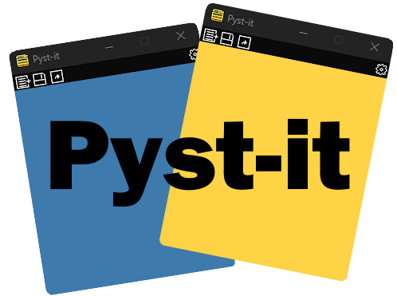

# Pyst-it  (Beta 0.9)
A simple sticky notes app.

  

✨ **Multiple Notes**: Open as many sticky notes as you want on your desktop, each in a different color. 
💾 **Auto-save**: Your notes are automatically saved, ensuring you never lose your progress. 
🌈 **Random Colors**: 9 vibrant colors for your notes, or even a rare RGB color for a fun touch. (Can you get it?) 
📠**File Support**: Save and load notes in both `.txt` and `.json` formats. 
🖥️ **Easy-to-use Interface**: Simple and intuitive interface with all essential features right at your fingertips. 
🔒 **Privacy First**: Notes are stored locally on your computer, and you can choose whether to save them or not. 

  

Full 1.0 version coming soon! 
**Planned Features for Version 1.0:**

âœï¸ **Customizable Fonts**: Choose from a variety of stylish fonts to give your notes a personal touch and make them truly yours. 
âœï¸ **Drawing Mode**: Unlock the ability to draw directly on your sticky notes. 
🔔 **Reminders & Notifications**: Set reminders to never forget your important tasks—get notified to check or save your notes whenever you need a prompt. 
 
🤠**Contribute**: Help me improve "Pyst-it"! Fork the repo, make changes, and submit a pull request. 
📧 **Contact:** If you have any questions or feedback, reach out at [kauarodr2005@gmail.com]. 
